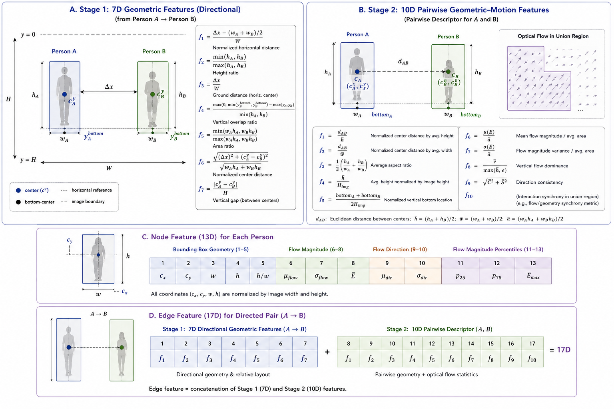
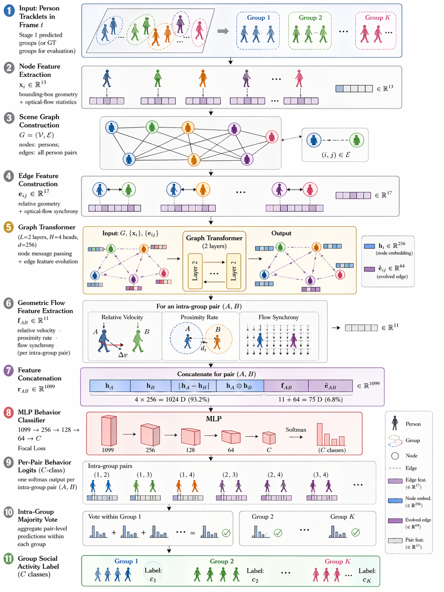

# Training Scripts

Shorter version can be found here: https://arxiv.org/abs/2602.22346

Longer/full version is my master thesis (but I dont have public link :D)

## Start
```bash
pip install -r requirements.txt
```

## Training on CAD Dataset

### Stage1 (detecting interaction)
```bash
python train_cad_stage1.py
```

### Stage2 (recognizing interaction)
```bash
python train_cad_stage2.py
```

## Training on JRDB Dataset

### Stage1
```bash
python train_jrdb_stage1.py
```

### Stage2 (also for ablation study)

Use `--frame_interval` to reduce running time.

Without backbone:
```bash
python train_jrdb_stage2_nobackbone.py --frame_interval 5
```

With backbone:
```bash
python train_jrdb_stage2_withbackbone.py --frame_interval 5
```

## GNN Settings
Use GNN module to build an interaction graph for better performance.

### Stage2 (with GNN)
```bash
python train_cad_stage2_gnn.py --frame_interval 5 # cad dataset
python train_jrdb_stage2_gnn.py --frame_interval 5 # jrdb dataset
python train_jrdb_stage2_gnn_nobackbone.py --frame_interval 5 # jrdb dataset (not adding visual backbone)
```

### E2E training
```bash
python train_jrdb_e2e_gnn.py
```


## Zero Shot Evaluation

General zero shot test on lawnmower dataset:
```bash
python infer_my_videos.py
```

## Dataset Placement

Datasets should be placed under `../dataset/` (relative to this project directory), i.e. alongside the project folder:

```
File folder/
├── dataset/
│   ├── cad/
│   │   └── ActivityDataset/
│   │       ├── social_CAD/              # Annotation files
│   │       │   ├── 1_annotations.txt
│   │       │   ├── 2_annotations.txt
│   │       │   └── ...
│   │       ├── seq01/                   # Frame images (seq01 ~ seq44)
│   │       │   ├── frame0001.jpg
│   │       │   ├── frame0011.jpg
│   │       │   └── ...
│   │       ├── seq02/
│   │       └── ...
│   ├── labels/
│   │   └── labels_2d_activity_social_stitched/   # JRDB social activity labels (.json)
│   └── images/
│       └── image_stitched/                       # JRDB stitched panoramic images
└── Code here/                                # This project
```

### CAD Dataset

- Default path: `../dataset/cad/ActivityDataset` (via `--cad_root`)
- Seq01-44, each sequence folder contains `frameXXXX.jpg` images
- Annotations are in `social_CAD/` directory, format: `{seq_num}_annotations.txt`
- Each annotation row: `frame_id x1 y1 x2 y2 individual_action_id social_activity_id track_id social_group_id`

### JRDB Dataset

- Default path: `../dataset` (via `--data_path`)
- Social labels: `labels/labels_2d_activity_social_stitched/*.json`
- Images: `images/image_stitched/`
- Scenes are automatically split by ratio: train 70%, val 15%, test 15%

### Notes

- Both dataset paths can be overridden via command-line arguments (`--cad_root` / `--data_path`)
- Ensure all annotation files are complete before training; missing files will raise `FileNotFoundError`

## Model Details

Features are demonstrated in the figure below.



### Stage 1: Geometric Features (7-Dimensional)

- **Normalized horizontal distance:** Absolute difference in horizontal center coordinates divided by the average width of the two bounding boxes.
- **Height ratio:** Minimum height divided by maximum height of the two bounding boxes.
- **Ground distance:** Vertical distance between bottom‑center points, normalized by the average height.
- **Vertical overlap ratio:** Intersection‑over‑union of the two bounding boxes along the vertical axis.
- **Area ratio:** Minimum area divided by maximum area of the two bounding boxes.
- **Normalized center distance:** Euclidean distance between centers, divided by $\sqrt{\bar{w}\bar{h}}$ where $\bar{w}, \bar{h}$ are average width and height.
- **Vertical gap:** Vertical distance between non‑overlapping bounding boxes, normalized by $\bar{h}$; negative or zero when vertical overlap exists.

### Stage 2: Geometric–Motion Features (10-Dimensional)

$f_1$ to $f_5$ are extracted from spatial distance and bounding box geometry and $f_6$ to $f_{10}$ are from optical flow.

- **Normalized center distance (by height) $f_1$:** Euclidean distance between bounding box centers divided by the average height.
- **Normalized center distance (by width) $f_2$:** Euclidean distance between centers divided by the average width.
- **Average aspect ratio $f_3$:** Arithmetic mean of the height‑to‑width ratios of the two bounding boxes.
- **Relative height $f_4$:** Average bounding box height divided by the image height.
- **Vertical position $f_5$:** Average bottom ordinate of the two bounding boxes, normalized by the image height.
- **Mean flow magnitude $f_6$:** Average magnitude of optical flow vectors inside the union of bounding boxes, divided by the average area.
- **Flow magnitude variance $f_7$:** Standard deviation of flow magnitudes, divided by the average area.
- **Vertical flow dominance $f_8$:** Ratio of average absolute vertical flow to average absolute horizontal flow (with a small $\epsilon$ to avoid division by zero).
- **Direction consistency $f_{10}$:** Circular variance of flow directions, measured by the length of the resultant vector.

#### Interaction Synchrony

- **Interaction synchrony $f_9$:** Weighted combination of flow magnitude similarity, temporal motion pattern similarity, posture consistency, and dominant direction alignment, with empirically determined weights.

> **Note:** To enforce permutation invariance, asymmetric features are computed from both $A \rightarrow B$ and $B \rightarrow A$ perspectives and symmetrized by averaging. All features are normalized to $[0, 1]$ or contain built‑in normalization as defined above.

### Stage 2 GNN: Graph-Based Scene Modeling

The GNN classifier builds a fully-connected directed scene graph over all detected persons in each frame. Node and edge representations are jointly refined by Graph Transformer message passing before pair-level behavior classification.



#### Node Features (5D / 13D)

Per-person node features are derived purely from bounding box geometry (no visual backbone required):

- **Normalized center-x:** Horizontal center coordinate of the bounding box divided by image width.
- **Normalized center-y:** Vertical center coordinate divided by image height.
- **Normalized width:** Bounding box width divided by image width.
- **Normalized height:** Bounding box height divided by image height.
- **Aspect ratio:** Height-to-width ratio of the bounding box.

With per-node optical flow enabled (`--flow_node_feats`), 8 additional per-person motion statistics are appended, expanding the node feature to 13D.

#### Edge Features (7D / 17D)

Each directed edge $(i \rightarrow j)$ carries the same 7D geometric features as Stage 1, encoding the spatial relationship from person $i$ to person $j$. When flow injection is enabled (`--inject_flow_to_edges`), the 10D pair-level optical flow feature vector is concatenated for target-pair edges, expanding those edges to 17D.

#### Graph Transformer Message Passing

2 Graph Transformer layers are applied (hidden dim = 256, 4 attention heads). Each layer performs two coupled updates in sequence:

- **Edge update:** Each edge absorbs context from its source node, destination node, and its own previous state via a residual gating unit (linear projections + SiLU activation + LayerNorm). Edge features therefore evolve across layers alongside node features.
- **Node update:** Each node aggregates weighted messages from its neighbors using multi-head attention, where attention scores are computed jointly from the source node, destination node, and the already-updated edge feature. A residual connection and LayerNorm are applied after aggregation.

Both node and edge representations evolve jointly across all layers.

#### Behavior Classifier

For each labeled positive pair (A, B), the classifier input is the concatenation of:

- Node embeddings of A and B (256D each)
- Element-wise absolute difference of the two embeddings (256D)
- Element-wise product of the two embeddings (256D)
- 10D geometric–motion feature vector
- Symmetrized evolved edge feature between A and B (64D)

This vector is passed through an MLP with hidden layers `[256, 128, 64]` to produce 3-class logits (Walking / Standing / Sitting Together).

#### Group Detection Head

A secondary binary head classifies all pairs — both positive (labeled) and negative (unlabeled, sampled from non-interacting persons in the same scene). Its input is the same node-embedding concatenation as the behavior classifier but without the flow features (which are unavailable for negative pairs). The head uses a compact MLP (`[256, 64] → 1` logit). Negative pair labels are derived automatically from pair membership with no extra annotation. The multi-task training loss combines behavior classification (weight 0.8) and group detection (weight 0.2).

#### Optional Structural Improvements

- **DropEdge:** Randomly discards a fraction of non-target-pair edges during training to regularize GNN message passing; edges belonging to target pairs are always preserved.
- **Virtual Global Node:** A virtual node connected bidirectionally to every person node in the scene; after GNN propagation its embedding aggregates full scene context and is appended to the behavior classifier input.
- **Cross-Pair Attention:** One self-attention layer applied over all pair representations within a scene before the final MLP, allowing each pair's classification to be informed by concurrent interactions in the same frame.
